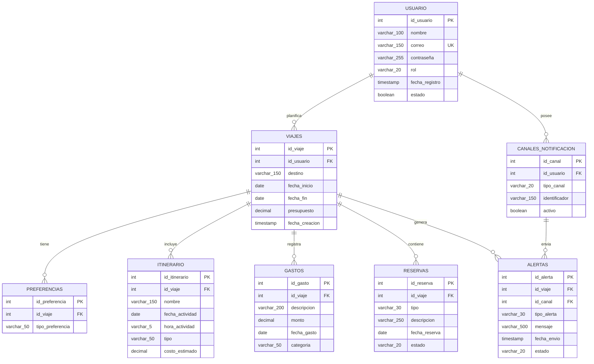

## Diagrama Entidad - Relacion 

```mermaid
erDiagram
    USUARIO ||--o{ VIAJES : planifica
    USUARIO ||--o{ CANALES_NOTIFICACION : posee
    VIAJES ||--o{ PREFERENCIAS : tiene
    VIAJES ||--o{ ITINERARIO : incluye
    VIAJES ||--o{ GASTOS : registra
    VIAJES ||--o{ RESERVAS : contiene
    VIAJES ||--o{ ALERTAS : genera
    CANALES_NOTIFICACION ||--o{ ALERTAS : envia

    USUARIO {
        int id_usuario PK
        varchar_100 nombre
        varchar_150 correo UK
        varchar_255 contraseña
        varchar_20 rol
        timestamp fecha_registro
        boolean estado
    }

    VIAJES {
        int id_viaje PK
        int id_usuario FK
        varchar_150 destino
        date fecha_inicio
        date fecha_fin
        decimal presupuesto
        timestamp fecha_creacion
    }

    CANALES_NOTIFICACION {
        int id_canal PK
        int id_usuario FK
        varchar_20 tipo_canal
        varchar_150 identificador
        boolean activo
    }

    PREFERENCIAS {
        int id_preferencia PK
        int id_viaje FK
        varchar_50 tipo_preferencia
    }

    ITINERARIO {
        int id_itinerario PK
        int id_viaje FK
        varchar_150 nombre
        date fecha_actividad
        varchar_5 hora_actividad
        varchar_50 tipo
        decimal costo_estimado
    }

    GASTOS {
        int id_gasto PK
        int id_viaje FK
        varchar_200 descripcion
        decimal monto
        date fecha_gasto
        varchar_50 categoria
    }

    RESERVAS {
        int id_reserva PK
        int id_viaje FK
        varchar_30 tipo
        varchar_250 descripcion
        date fecha_reserva
        varchar_20 estado
    }

    ALERTAS {
        int id_alerta PK
        int id_viaje FK
        int id_canal FK
        varchar_30 tipo_alerta
        varchar_500 mensaje
        timestamp fecha_envio
        varchar_20 estado
    }
```
