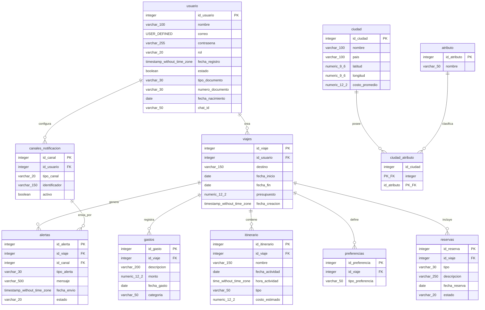

## Diagrama Entidad - Relacion 

```mermaid
erDiagram
    usuario ||--o{ viajes : "crea"
    usuario ||--o{ canales_notificacion : "configura"
    viajes ||--o{ alertas : "genera"
    canales_notificacion ||--o{ alertas : "envia_por"
    viajes ||--o{ gastos : "registra"
    viajes ||--o{ itinerario : "contiene"
    viajes ||--o{ preferencias : "define"
    viajes ||--o{ reservas : "incluye"
    ciudad ||--o{ ciudad_atributo : "posee"
    atributo ||--o{ ciudad_atributo : "clasifica"

    usuario {
        integer id_usuario PK
        varchar_100 nombre
        USER_DEFINED correo
        varchar_255 contrasena
        varchar_20 rol
        timestamp_without_time_zone fecha_registro
        boolean estado
        varchar_30 tipo_documento
        varchar_30 numero_documento
        date fecha_nacimiento
        varchar_50 chat_id
    }

    viajes {
        integer id_viaje PK
        integer id_usuario FK
        varchar_150 destino
        date fecha_inicio
        date fecha_fin
        numeric_12_2 presupuesto
        timestamp_without_time_zone fecha_creacion
    }

    canales_notificacion {
        integer id_canal PK
        integer id_usuario FK
        varchar_20 tipo_canal
        varchar_150 identificador
        boolean activo
    }

    alertas {
        integer id_alerta PK
        integer id_viaje FK
        integer id_canal FK
        varchar_30 tipo_alerta
        varchar_500 mensaje
        timestamp_without_time_zone fecha_envio
        varchar_20 estado
    }

    gastos {
        integer id_gasto PK
        integer id_viaje FK
        varchar_200 descripcion
        numeric_12_2 monto
        date fecha_gasto
        varchar_50 categoria
    }

    itinerario {
        integer id_itinerario PK
        integer id_viaje FK
        varchar_150 nombre
        date fecha_actividad
        time_without_time_zone hora_actividad
        varchar_50 tipo
        numeric_12_2 costo_estimado
    }

    preferencias {
        integer id_preferencia PK
        integer id_viaje FK
        varchar_50 tipo_preferencia
    }

    reservas {
        integer id_reserva PK
        integer id_viaje FK
        varchar_30 tipo
        varchar_250 descripcion
        date fecha_reserva
        varchar_20 estado
    }

    ciudad {
        integer id_ciudad PK
        varchar_100 nombre
        varchar_100 pais
        numeric_9_6 latitud
        numeric_9_6 longitud
        numeric_12_2 costo_promedio
    }

    atributo {
        integer id_atributo PK
        varchar_50 nombre
    }

    ciudad_atributo {
        integer id_ciudad PK_FK
        integer id_atributo PK_FK
    }
```
