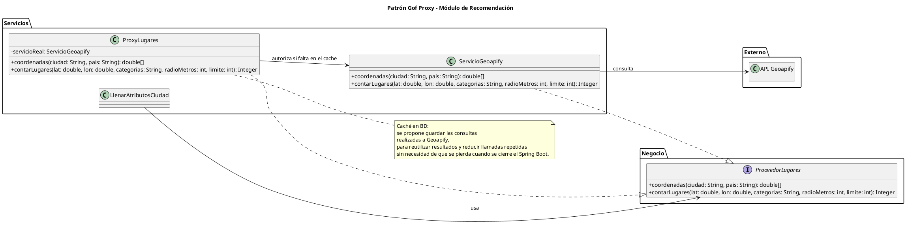

## Diagrama Patron GoF Proxy 

codigo: 

```plantuml
@startuml
title Patrón Gof Proxy - Módulo de Recomendación

left to right direction
skinparam classAttributeIconSize 0

package "Negocio" {

    interface ProovedorLugares {
        +coordenadas(ciudad: String, pais: String): double[]
        +contarLugares(lat: double, lon: double, categorias: String, radioMetros: int, limite: int): Integer
    }
}

package "Servicios" {

    class ProxyLugares {
        -servicioReal: ServicioGeoapify
        +coordenadas(ciudad: String, pais: String): double[]
        +contarLugares(lat: double, lon: double, categorias: String, radioMetros: int, limite: int): Integer
    }

    class ServicioGeoapify {
        +coordenadas(ciudad: String, pais: String): double[]
        +contarLugares(lat: double, lon: double, categorias: String, radioMetros: int, limite: int): Integer
    }

    class LlenarAtributosCiudad
}

package "Externo" {
    class "API Geoapify" as Geoapify
}

ProxyLugares ..|> ProovedorLugares
ServicioGeoapify ..|> ProovedorLugares

LlenarAtributosCiudad --> ProovedorLugares : usa
ProxyLugares --> ServicioGeoapify : autoriza si falta en el cache
ServicioGeoapify --> Geoapify : consulta

note right of ProxyLugares
  Caché en BD:
  se propone guardar las consultas
  realizadas a Geoapify,
  para reutilizar resultados y reducir llamadas repetidas
  sin necesidad de que se pierda cuando se cierre el Spring Boot.
end note

@enduml
```

## Diagrama Visual 

