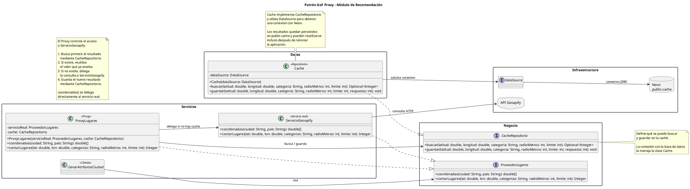

## Diagrama Patron GoF Proxy 

codigo: 

```plantuml
@startuml
allowmixing

title Patrón GoF Proxy - Módulo de Recomendación

left to right direction
skinparam classAttributeIconSize 0
skinparam packageStyle rectangle


package "Negocio" {

    interface ProovedorLugares {
        +coordenadas(ciudad: String, pais: String): double[]
        +contarLugares(lat: double, lon: double, categorias: String, radioMetros: int, limite: int): Integer
    }

    interface CacheRepositorio {
        +buscar(latitud: double, longitud: double, categoria: String, radioMetros: int, limite: int): Optional<Integer>
        +guardar(latitud: double, longitud: double, categoria: String, radioMetros: int, limite: int, respuesta: int): void
    }
}


package "Servicios" {

    class LlenarAtributosCiudad <<Cliente>>

    class ProxyLugares <<Proxy>> {
        -servicioReal: ProovedorLugares
        -cache: CacheRepositorio
        +ProxyLugares(servicioReal: ProovedorLugares, cache: CacheRepositorio)
        +coordenadas(ciudad: String, pais: String): double[]
        +contarLugares(lat: double, lon: double, categorias: String, radioMetros: int, limite: int): Integer
    }

    class ServicioGeoapify <<Servicio real>> {
        +coordenadas(ciudad: String, pais: String): double[]
        +contarLugares(lat: double, lon: double, categorias: String, radioMetros: int, limite: int): Integer
    }
}


package "Datos" {

    class Cache <<Repositorio>> {
        -dataSource: DataSource
        +Cache(dataSource: DataSource)
        +buscar(latitud: double, longitud: double, categoria: String, radioMetros: int, limite: int): Optional<Integer>
        +guardar(latitud: double, longitud: double, categoria: String, radioMetros: int, limite: int, respuesta: int): void
    }
}


package "Infraestructura" {

    interface DataSource

    database "Neon\npublic.cache" as BD

    cloud "API Geoapify" as Geoapify
}

' RELACIONES DEL PATRÓN PROXY


LlenarAtributosCiudad --> ProovedorLugares : usa

ProxyLugares ..|> ProovedorLugares
ServicioGeoapify ..|> ProovedorLugares

ProxyLugares --> ServicioGeoapify : delega si no hay cache
ProxyLugares --> CacheRepositorio : busca / guarda

' CACHE

Cache ..|> CacheRepositorio

Cache --> DataSource : solicita conexion
DataSource --> BD : conexion JDBC

' SERVICIO EXTERNO

ServicioGeoapify --> Geoapify : consulta HTTP


note as N1
  El Proxy controla el acceso
  a ServicioGeoapify.

  1. Busca primero el resultado
     mediante CacheRepositorio.
  2. Si existe, reutiliza
     el valor que ya estaba.
  3. Si no existe, delega
     la consulta a ServicioGeoapify.
  4. Guarda el nuevo resultado
     mediante CacheRepositorio.

  coordenadas() se delega
  directamente al servicio real.
end note


note right of CacheRepositorio
  Define qué se puede buscar
  y guardar en la caché.

  La conexión con la base de datos
  la maneja la clase Cache.
end note


note bottom of Cache
  Cache implementa CacheRepositorio
  y utiliza DataSource para obtener
  una conexion con Neon.

  Los resultados quedan persistidos
  en public.cache y pueden reutilizarse
  incluso después de reiniciar
  la aplicación.
end note

@enduml
```

## Diagrama Visual 

