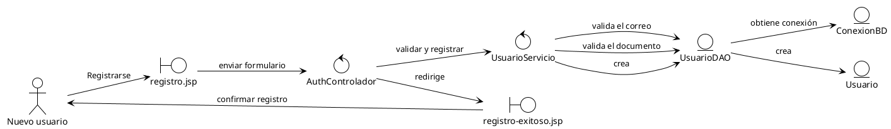

## Diagrama Crear Usuario

```plantuml
@startuml
!theme plain
left to right direction

actor "Nuevo usuario" as Actor

boundary "registro.jsp"
boundary "registro-exitoso.jsp"
control "AuthControlador"
control "UsuarioServicio"
entity "UsuarioDAO"
entity "ConexionBD"
entity "Usuario" as UsuarioEntidad

Actor --> "registro.jsp" : Registrarse
"registro.jsp" --> "AuthControlador" : enviar formulario

"AuthControlador" --> "UsuarioServicio" : validar y registrar

"UsuarioServicio" --> "UsuarioDAO" : valida el correo
"UsuarioServicio" --> "UsuarioDAO" : valida el documento
"UsuarioServicio" --> "UsuarioDAO" : crea

"UsuarioDAO" --> "ConexionBD" : obtiene conexión
"UsuarioDAO" --> UsuarioEntidad : crea

"AuthControlador" --> "registro-exitoso.jsp" : redirige
"registro-exitoso.jsp" --> Actor : confirmar registro
@enduml
```
## Imagen Crear cuenta
---

