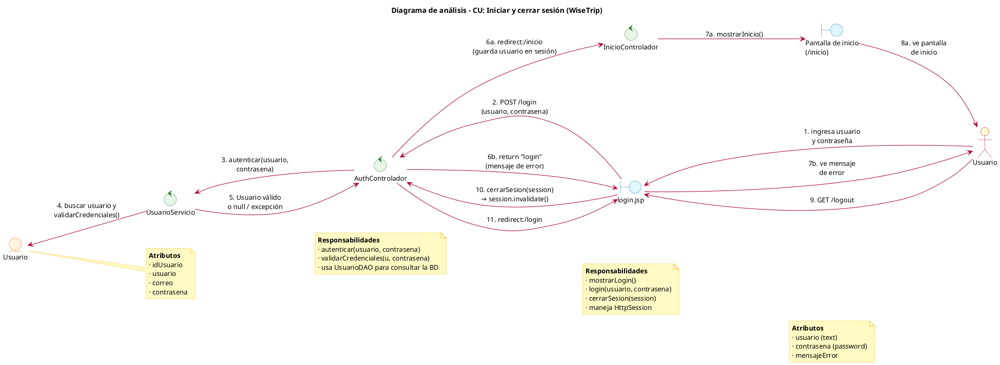

## Diagrama Inicio de sesion

```plantuml
@startuml DiagramaAnalisis_Login_WiseTrip
left to right direction
skinparam shadowing false
skinparam defaultFontSize 13
skinparam nodesep 60
skinparam ranksep 100
skinparam ArrowColor #A80036
skinparam ActorBorderColor #A80036
skinparam ActorBackgroundColor #FEFECE
skinparam BoundaryBorderColor #0277BD
skinparam BoundaryBackgroundColor #E1F5FE
skinparam ControlBorderColor #2E7D32
skinparam ControlBackgroundColor #E8F5E9
skinparam EntityBorderColor #EF6C00
skinparam EntityBackgroundColor #FFF3E0
skinparam NoteBackgroundColor #FFF9C4
skinparam NoteBorderColor #FBC02D

title Diagrama de análisis – CU: Iniciar y cerrar sesión (WiseTrip)

entity "Usuario" as Usr
control "UsuarioServicio" as Srv
control "AuthControlador" as Auth
control "InicioControlador" as IniCtrl
boundary "login.jsp" as Login
boundary "Pantalla de inicio\n(/inicio)" as Inicio
actor "Usuario" as User

Login <-- User : 1. ingresa usuario\ny contraseña
Auth <-- Login : 2. POST /login\n(usuario, contrasena)
Srv <-- Auth : 3. autenticar(usuario,\ncontrasena)
Usr <-- Srv : 4. buscar usuario y\nvalidarCredenciales()
Srv --> Auth : 5. Usuario válido\no null / excepción
Auth --> IniCtrl : 6a. redirect:/inicio\n(guarda usuario en sesión)
IniCtrl --> Inicio : 7a. mostrarInicio()
Inicio --> User : 8a. ve pantalla\nde inicio
Auth --> Login : 6b. return "login"\n(mensaje de error)
Login --> User : 7b. ve mensaje\nde error
Login <-- User : 9. GET /logout
Auth <-- Login : 10. cerrarSesion(session)\n→ session.invalidate()
Auth --> Login : 11. redirect:/login

note as NotaLogin
  **Atributos**
  · usuario (text)
  · contrasena (password)
  · mensajeError
end note

note as NotaAuth
  **Responsabilidades**
  · mostrarLogin()
  · login(usuario, contrasena)
  · cerrarSesion(session)
  · maneja HttpSession
end note

note as NotaSrv
  **Responsabilidades**
  · autenticar(usuario, contrasena)
  · validarCredenciales(u, contrasena)
  · usa UsuarioDAO para consultar la BD
end note

note as NotaUsr
  **Atributos**
  · idUsuario
  · usuario
  · correo
  · contrasena
end note

Login -[hidden]down- NotaLogin
Auth -[hidden]down- NotaAuth
Srv -[hidden]down- NotaSrv
Usr -[hidden]down- NotaUsr

@enduml
```

## Imagen del diagrama de Analisis

