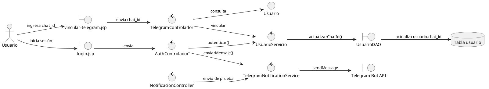

# Diagrama de análisis - Notificaciones Telegram

```plantuml
@startuml
left to right direction

actor "Usuario" as ActorUsuario

boundary "vincular-telegram.jsp" as VistaTelegram
boundary "login.jsp" as VistaLogin
control "TelegramControlador" as TelegramControlador
control "AuthControlador" as AuthControlador
control "NotificacionController" as NotificacionController
control "UsuarioServicio" as UsuarioServicio
boundary "UsuarioDAO" as UsuarioDAO
entity "Usuario" as Usuario
database "Tabla usuario" as TablaUsuario
control "TelegramNotificationService" as TelegramService
boundary "Telegram Bot API" as TelegramAPI

ActorUsuario --> VistaTelegram : ingresa chat_id
VistaTelegram --> TelegramControlador : envia chat_id
TelegramControlador --> UsuarioServicio : vincular
TelegramControlador --> Usuario : consulta
UsuarioServicio --> UsuarioDAO : actualizarChatId()
UsuarioDAO --> TablaUsuario : actualiza usuario.chat_id

ActorUsuario --> VistaLogin : inicia sesión
VistaLogin --> AuthControlador : envia
AuthControlador --> UsuarioServicio : autenticar()
AuthControlador --> TelegramService : enviarMensaje()

NotificacionController --> TelegramService : envío de prueba
TelegramService --> TelegramAPI : sendMessage

@enduml
```

## Imagen Diagrama de análisis - Notificaciones Telegram

