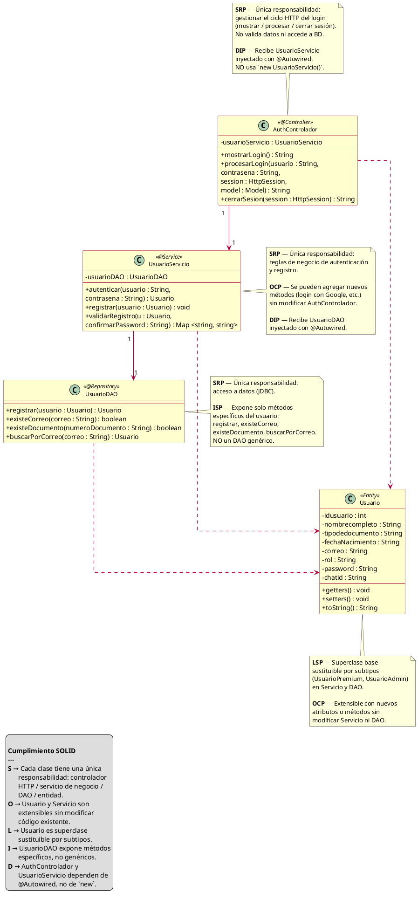

## Diagrama de Clases - inicio de sesion 

```plantuml

@startuml DiagramaClases_Login
skinparam classAttributeIconSize 0
skinparam linetype ortho
skinparam nodesep 55
skinparam ranksep 90
skinparam class {
  BackgroundColor #FEFECE
  BorderColor #A80036
  ArrowColor #A80036
  FontSize 12
}
skinparam arrow {
  Color #A80036
  Thickness 1.2
}

' ==================== CLASES ====================

class AuthControlador <<@Controller>> {
  - usuarioServicio : UsuarioServicio
  --
  + mostrarLogin() : String
  + procesarLogin(usuario : String,
                  contrasena : String,
                  session : HttpSession,
                  model : Model) : String
  + cerrarSesion(session : HttpSession) : String
}


class UsuarioServicio <<@Service>> {
  - usuarioDAO : UsuarioDAO
  --
  + autenticar(usuario : String,
               contrasena : String) : Usuario
  + registrar(usuario : Usuario) : void
  + validarRegistro(u : Usuario,
                    confirmarPassword : String) : Map <string, string>
}

class UsuarioDAO <<@Repository>> {
  --
  + registrar(usuario : Usuario) : Usuario
  + existeCorreo(correo : String) : boolean
  + existeDocumento(numeroDocumento : String) : boolean
  + buscarPorCorreo(correo : String) : Usuario
}

class Usuario <<Entity>> {
  - idusuario : int
  - nombrecompleto : String
  - tipodedocumento : String
  - fechaNacimiento : String
  - correo : String
  - rol : String
  - password : String
  - chatid : String
  --
  + getters() : void
  + setters() : void
  + toString() : String
}

' ==================== RELACIONES ====================

' --- Asociación (atributo persistente @Autowired) ---
AuthControlador "1" --> "1" UsuarioServicio
UsuarioServicio "1" --> "1" UsuarioDAO


' --- Dependencia (uso temporal) ---
AuthControlador  ..>  Usuario
UsuarioServicio  ..>  Usuario
UsuarioDAO ..> Usuario 


' ==================== JUSTIFICACIÓN SOLID ====================

note top of AuthControlador
  **SRP** — Única responsabilidad:
  gestionar el ciclo HTTP del login
  (mostrar / procesar / cerrar sesión).
  No valida datos ni accede a BD.

  **DIP** — Recibe UsuarioServicio
  inyectado con @Autowired.
  NO usa `new UsuarioServicio()`.
end note

note right of UsuarioServicio
  **SRP** — Única responsabilidad:
  reglas de negocio de autenticación
  y registro.

  **OCP** — Se pueden agregar nuevos
  métodos (login con Google, etc.)
  sin modificar AuthControlador.

  **DIP** — Recibe UsuarioDAO
  inyectado con @Autowired.
end note

note right of UsuarioDAO
  **SRP** — Única responsabilidad:
  acceso a datos (JDBC).

  **ISP** — Expone solo métodos
  específicos del usuario:
  registrar, existeCorreo,
  existeDocumento, buscarPorCorreo.
  NO un DAO genérico.
end note

note bottom of Usuario
  **LSP** — Superclase base
  sustituible por subtipos
  (UsuarioPremium, UsuarioAdmin)
  en Servicio y DAO.

  **OCP** — Extensible con nuevos
  atributos o métodos sin
  modificar Servicio ni DAO.
end note

legend left

  **Cumplimiento SOLID **
  ---
  **S** → Cada clase tiene una única
        responsabilidad: controlador
        HTTP / servicio de negocio /
        DAO / entidad.
  **O** → Usuario y Servicio son
        extensibles sin modificar
        código existente.
  **L** → Usuario es superclase
        sustituible por subtipos.
  **I** → UsuarioDAO expone métodos
        específicos, no genéricos.
  **D** → AuthControlador y
        UsuarioServicio dependen de
        @Autowired, no de `new`.
end legend

@enduml
```

## Imagen del Diagrama 

