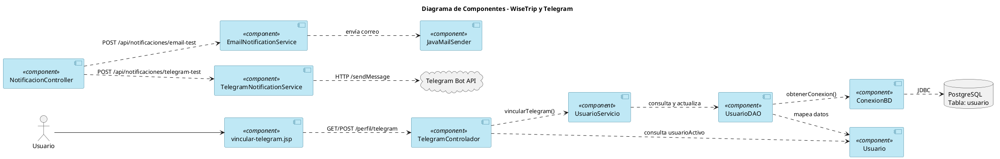

# Diagrama de componentes - WiseTrip y Telegram

```plantuml
@startuml
title Diagrama de Componentes - WiseTrip y Telegram
left to right direction

skinparam componentStyle uml2
skinparam componentBackgroundColor #BFE8F5
skinparam componentBorderColor #26728E

actor Usuario

component "vincular-telegram.jsp" as VincularTelegram <<component>>
component "TelegramControlador" as TelegramControlador <<component>>
component "UsuarioServicio" as UsuarioServicio <<component>>
component "UsuarioDAO" as UsuarioDAO <<component>>
component "Usuario" as UsuarioEntidad <<component>>
component "ConexionBD" as ConexionBD <<component>>

component "NotificacionController" as NotificacionController <<component>>
component "EmailNotificationService" as EmailService <<component>>
component "JavaMailSender" as JavaMailSender <<component>>
component "TelegramNotificationService" as TelegramService <<component>>

database "PostgreSQL\nTabla: usuario" as BaseDatos
cloud "Telegram Bot API" as TelegramAPI

Usuario --> VincularTelegram
VincularTelegram ..> TelegramControlador : GET/POST /perfil/telegram
TelegramControlador ..> UsuarioServicio : vincularTelegram()
TelegramControlador ..> UsuarioEntidad : consulta usuarioActivo

UsuarioServicio ..> UsuarioDAO : consulta y actualiza
UsuarioDAO ..> UsuarioEntidad : mapea datos
UsuarioDAO ..> ConexionBD : obtenerConexion()
ConexionBD ..> BaseDatos : JDBC

NotificacionController ..> EmailService : POST /api/notificaciones/email-test
NotificacionController ..> TelegramService : POST /api/notificaciones/telegram-test
EmailService ..> JavaMailSender : envía correo
TelegramService ..> TelegramAPI : HTTP /sendMessage

@enduml
```

## Imagen Diagrama de componentes - WiseTrip y Telegram

