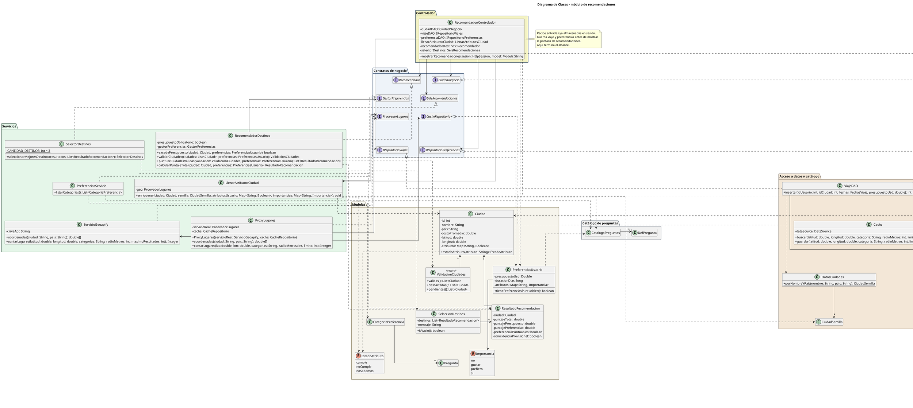

## Diagrama De Clase del Moduloo 2 - Recomendaciones Personalizadas

Codigo

```plantuml
@startuml

title Diagrama de Clases - módulo de recomendaciones

top to bottom direction

skinparam classAttributeIconSize 0
skinparam shadowing false
skinparam linetype ortho

' Separación entre clases
skinparam nodesep 50
skinparam ranksep 50

hide empty members

'Controlador
package "Controlador" #f4f3c4;line:1F3A5F {
    class RecomendacionControlador {
        -ciudadDAO: CiudadNegocio
        -viajeDAO: IRepositorioViajes
        -preferenciaDAO: IRepositorioPreferencias
        -llenarAtributosCiudad: LlenarAtributosCiudad
        -recomendadorDestinos: Recomendador
        -selectorDestinos: SeleRecomendaciones
        +mostrarRecomendaciones(sesion: HttpSession, model: Model): String
    }
}

'Contratos
package "Contratos de negocio" #EEF3F9;line:1F3A5F {
    interface CiudadNegocio
    interface Recomendador
    interface SeleRecomendaciones
    interface GestorPreferencias
    interface ProovedorLugares
    interface CacheRepositorio
    interface IRepositorioViajes
    interface IRepositorioPreferencias

    CiudadNegocio -[hidden]right-> Recomendador
    SeleRecomendaciones -[hidden]right-> GestorPreferencias
    ProovedorLugares -[hidden]right-> CacheRepositorio
    IRepositorioViajes -[hidden]right-> IRepositorioPreferencias

    CiudadNegocio -[hidden]down-> SeleRecomendaciones
    SeleRecomendaciones -[hidden]down-> ProovedorLugares
    ProovedorLugares -[hidden]down-> IRepositorioViajes
}

'Servicios
package "Servicios" #e5f6e9;line:3C5A4A {
    class RecomendadorDestinos {
        -presupuestoObligatorio: boolean
        -gestorPreferencias: GestorPreferencias
        +excedePresupuesto(ciudad: Ciudad, preferencias: PreferenciasUsuario): boolean
        +validarCiudades(ciudades: List<Ciudad>, preferencias: PreferenciasUsuario): ValidacionCiudades
        +puntuarCiudadesValidas(validacion: ValidacionCiudades, preferencias: PreferenciasUsuario): List<ResultadoRecomendacion>
        +calcularPuntajeTotal(ciudad: Ciudad, preferencias: PreferenciasUsuario): ResultadoRecomendacion
    }

    class SelectorDestinos {
        {static} -CANTIDAD_DESTINOS: int = 3
        +seleccionarMejoresDestinos(resultados: List<ResultadoRecomendacion>): SeleccionDestinos
    }

    class PreferenciasServicio {
        +listarCategorias(): List<CategoriaPreferencia>
    }

    class LlenarAtributosCiudad {
        -geo: ProovedorLugares
        +enriquecer(ciudad: Ciudad, semilla: CiudadSemilla, atributosUsuario: Map<String, Boolean>, importancias: Map<String, Importancia>): void
    }

    class ProxyLugares {
        -servicioReal: ProovedorLugares
        -cache: CacheRepositorio
        +ProxyLugares(servicioReal: ServicioGeoapify, cache: CacheRepositorio)
        +coordenadas(ciudad: String, pais: String): double[]
        +contarLugares(lat: double, lon: double, categorias: String, radioMetros: int, limite: int): Integer
    }

    class ServicioGeoapify {
        -claveApi: String
        +coordenadas(ciudad: String, pais: String): double[]
        +contarLugares(latitud: double, longitud: double, categorias: String, radioMetros: int, maximoResultados: int): Integer
    }

    RecomendadorDestinos -[hidden]right-> SelectorDestinos
    PreferenciasServicio -[hidden]right-> LlenarAtributosCiudad
    ProxyLugares -[hidden]right-> ServicioGeoapify

    RecomendadorDestinos -[hidden]down-> PreferenciasServicio
    PreferenciasServicio -[hidden]down-> ProxyLugares
}

'Acceso a datos
package "Acceso a datos y catálogo" #f3e7d7;line:6B5B4B {
    class CiudadDAO {
        +obtenerTodas(): List<Ciudad>
    }

    class ViajeDAO {
        +insertar(idUsuario: int, idCiudad: int, fechas: FechasViaje, presupuestoUsd: double): int
    }

    class PreferenciaDAO {
        +guardarActivas(idViaje: int, atributosSeleccionados: Map<String, Boolean>): void
    }

    class Cache {
        -dataSource: DataSource
        +buscar(latitud: double, longitud: double, categoria: String, radioMetros: int, limite: int): Optional<Integer>
        +guardar(latitud: double, longitud: double, categoria: String, radioMetros: int, limite: int, respuesta: int): void
    }

    class ConexionBD

    class DatosCiudades {
        {static} +porNombreYPais(nombre: String, pais: String): CiudadSemilla
    }

    class CiudadSemilla

    CiudadDAO -[hidden]right-> ViajeDAO
    PreferenciaDAO -[hidden]right-> Cache
    ConexionBD -[hidden]right-> DatosCiudades

    CiudadDAO -[hidden]down-> PreferenciaDAO
    PreferenciaDAO -[hidden]down-> ConexionBD
    DatosCiudades -[hidden]down-> CiudadSemilla
}

'Catálogo de preguntas
package "Catálogo de preguntas" #F1F1F1;line:5A6472 {
    class CatalogoPreguntas
    class DefPregunta
    CatalogoPreguntas -[hidden]right-> DefPregunta
}

'Modelos
package "Modelos" #F6F4EC;line:7A6F4D {
    class Ciudad {
        -id: int
        -nombre: String
        -pais: String
        -costoPromedio: double
        -latitud: double
        -longitud: double
        -atributos: Map<String, Boolean>
        +estadoAtributo(atributo: String): EstadoAtributo
    }

    class PreferenciasUsuario {
        -presupuestoUsd: Double
        -duracionDias: long
        -atributos: Map<String, Importancia>
        +tienePreferenciasPuntuables(): boolean
    }

    class ValidacionCiudades <<record>> {
        +validas(): List<Ciudad>
        +descartadas(): List<Ciudad>
        +pendientes(): List<Ciudad>
    }

    class ResultadoRecomendacion {
        -ciudad: Ciudad
        -puntajeTotal: double
        -puntajePresupuesto: double
        -puntajePreferencias: double
        -preferenciasPuntuables: boolean
        -coincidenciaProvisional: boolean
    }

    class SeleccionDestinos {
        -destinos: List<ResultadoRecomendacion>
        -mensaje: String
        +isVacio(): boolean
    }

    class CategoriaPreferencia
    class Pregunta

    enum Importancia {
        no
        gustar
        prefiero
        si
    }

    enum EstadoAtributo {
        cumple
        noCumple
        noSabemos
    }

    Ciudad -[hidden]right-> PreferenciasUsuario
    ValidacionCiudades -[hidden]right-> ResultadoRecomendacion
    SeleccionDestinos -[hidden]right-> CategoriaPreferencia
    Pregunta -[hidden]right-> Importancia

    Ciudad -[hidden]down-> ValidacionCiudades
    ValidacionCiudades -[hidden]down-> SeleccionDestinos
    SeleccionDestinos -[hidden]down-> Pregunta
    Importancia -[hidden]right-> EstadoAtributo
}


package "Contexto e infraestructura" #F5F5F5;line:8A8F98 {
    class FechasViaje <<entrada existente>>
    interface DataSource <<JDBC>>
    FechasViaje -[hidden]right-> DataSource
}

RecomendacionControlador -[hidden]down-> CiudadNegocio
IRepositorioViajes -[hidden]down-> RecomendadorDestinos
ProxyLugares -[hidden]down-> CiudadDAO
ConexionBD -[hidden]down-> CatalogoPreguntas
CatalogoPreguntas -[hidden]down-> Ciudad
Pregunta -[hidden]down-> FechasViaje
RecomendadorDestinos .up.|> Recomendador
SelectorDestinos .up.|> SeleRecomendaciones
PreferenciasServicio .up.|> GestorPreferencias
ProxyLugares .up.|> ProovedorLugares
ServicioGeoapify .up.|> ProovedorLugares
CiudadDAO .up.|> CiudadNegocio
Cache .up.|> CacheRepositorio
ViajeDAO .up.|> IRepositorioViajes
PreferenciaDAO .up.|> IRepositorioPreferencias
RecomendacionControlador -down-> CiudadNegocio
RecomendacionControlador -down-> Recomendador
RecomendacionControlador -down-> SeleRecomendaciones
RecomendacionControlador -down-> IRepositorioViajes
RecomendacionControlador -down-> IRepositorioPreferencias
RecomendacionControlador -down-> LlenarAtributosCiudad
RecomendacionControlador .down.> DatosCiudades
RecomendacionControlador .down.> PreferenciasUsuario
RecomendacionControlador .down.> FechasViaje
RecomendadorDestinos -up-> GestorPreferencias
RecomendadorDestinos .down.> PreferenciasUsuario
RecomendadorDestinos .down.> ValidacionCiudades
RecomendadorDestinos .down.> ResultadoRecomendacion
SelectorDestinos .down.> ResultadoRecomendacion
SelectorDestinos .down.> SeleccionDestinos

LlenarAtributosCiudad -up-> ProovedorLugares
LlenarAtributosCiudad .down.> Ciudad
LlenarAtributosCiudad .down.> CiudadSemilla
LlenarAtributosCiudad .down.> CatalogoPreguntas
LlenarAtributosCiudad .down.> EstadoAtributo
ProxyLugares -up-> ProovedorLugares
ProxyLugares -right-> ServicioGeoapify
ProxyLugares -up-> CacheRepositorio
CiudadDAO .down.> Ciudad
CiudadDAO -down-> ConexionBD
ViajeDAO -down-> ConexionBD
PreferenciaDAO -down-> ConexionBD
Cache -down-> DataSource

DatosCiudades -down-> "*" CiudadSemilla
CatalogoPreguntas -right-> "*" DefPregunta
PreferenciasServicio .down.> CatalogoPreguntas
PreferenciasServicio .down.> CategoriaPreferencia
PreferenciasUsuario .up.> CatalogoPreguntas
CategoriaPreferencia -right-> "*" Pregunta
PreferenciasUsuario -down-> Importancia
Ciudad .down.> EstadoAtributo
ValidacionCiudades -up-> "*" Ciudad
ResultadoRecomendacion -up-> "1" Ciudad
SeleccionDestinos -right-> "*" ResultadoRecomendacion

note right of RecomendacionControlador
    Recibe entradas ya almacenadas en sesión.
    Guarda viaje y preferencias antes de mostrar
    la pantalla de recomendaciones.
    Aquí termina el alcance.
end note

@enduml
```

## Diagrama Visual 

