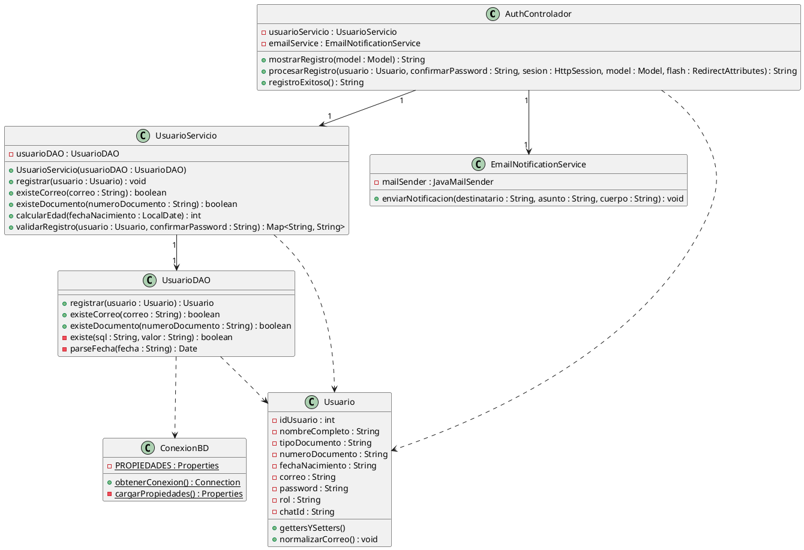

# Diagrama de Clases de Crear Cuenta 

```plantuml
@startuml
class AuthControlador {
    - usuarioServicio : UsuarioServicio
    - emailService : EmailNotificationService

    + mostrarRegistro(model : Model) : String
    + procesarRegistro(usuario : Usuario, confirmarPassword : String, sesion : HttpSession, model : Model, flash : RedirectAttributes) : String
    + registroExitoso() : String
}

class UsuarioServicio {
    - usuarioDAO : UsuarioDAO

    + UsuarioServicio(usuarioDAO : UsuarioDAO)
    + registrar(usuario : Usuario) : void
    + existeCorreo(correo : String) : boolean
    + existeDocumento(numeroDocumento : String) : boolean
    + calcularEdad(fechaNacimiento : LocalDate) : int
    + validarRegistro(usuario : Usuario, confirmarPassword : String) : Map<String, String>
}

class EmailNotificationService {
    - mailSender : JavaMailSender

    + enviarNotificacion(destinatario : String, asunto : String, cuerpo : String) : void
}

class UsuarioDAO {
    + registrar(usuario : Usuario) : Usuario
    + existeCorreo(correo : String) : boolean
    + existeDocumento(numeroDocumento : String) : boolean
    - existe(sql : String, valor : String) : boolean
    - parseFecha(fecha : String) : Date
}

class Usuario {
    - idUsuario : int
    - nombreCompleto : String
    - tipoDocumento : String
    - numeroDocumento : String
    - fechaNacimiento : String
    - correo : String
    - password : String
    - rol : String
    - chatId : String

    + gettersYSetters()
    + normalizarCorreo() : void
}

class ConexionBD {
    {static} - PROPIEDADES : Properties
    {static} + obtenerConexion() : Connection
    {static} - cargarPropiedades() : Properties
}


AuthControlador "1" --> "1" UsuarioServicio 
AuthControlador "1" --> "1" EmailNotificationService  
AuthControlador ..> Usuario 

UsuarioServicio "1" --> "1" UsuarioDAO 

UsuarioServicio ..> Usuario
UsuarioDAO ..> Usuario 
UsuarioDAO ..> ConexionBD
@enduml
```

# Imagen del diagrama 

