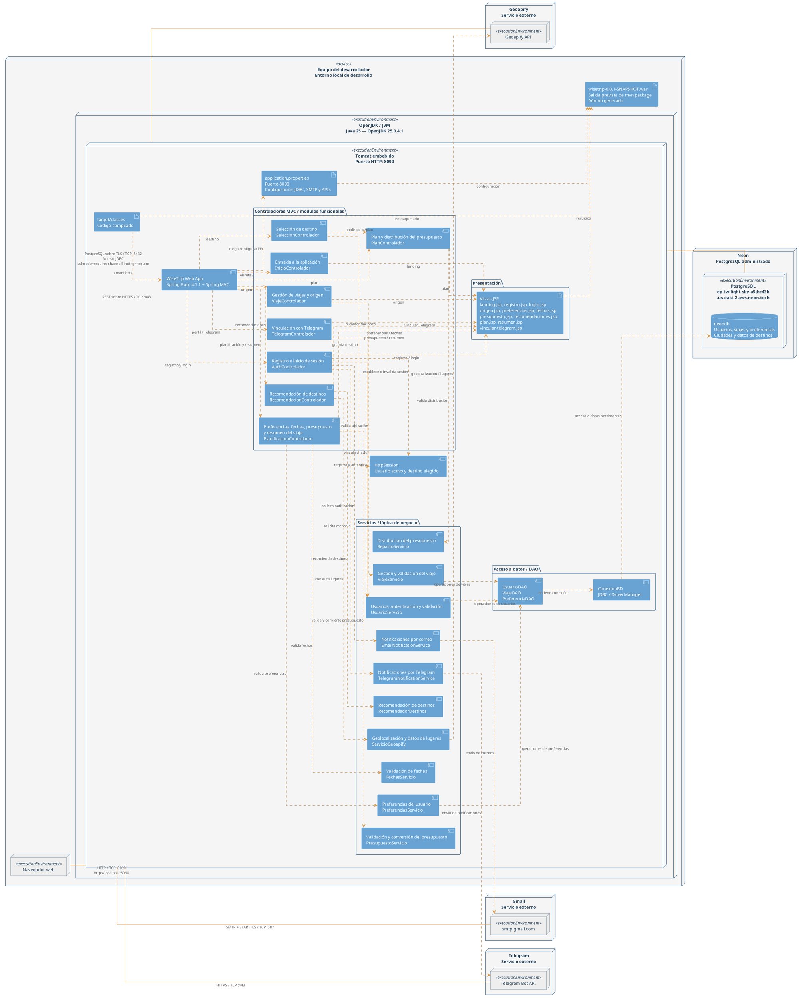
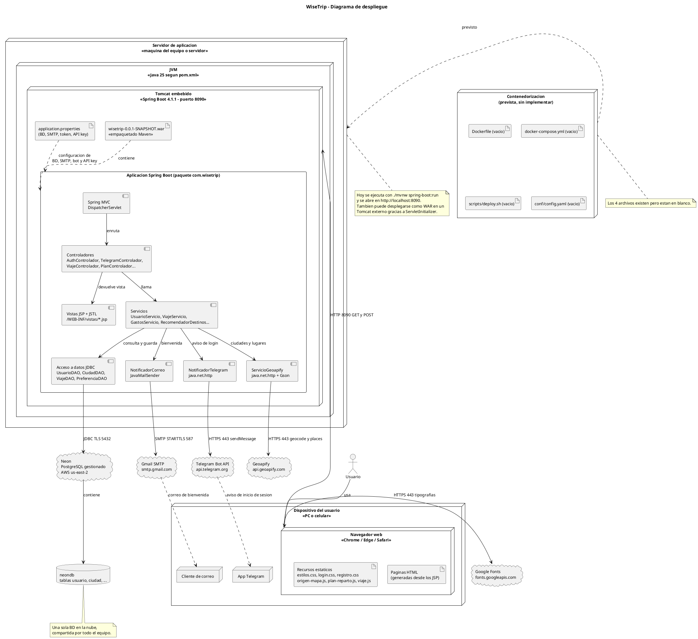

## Diagrama despliegue 

```plantuml
@startuml WiseTrip_Despliegue_Completo
left to right direction
skinparam backgroundColor white
skinparam shadowing false
skinparam linetype ortho
skinparam componentStyle uml2
skinparam defaultFontName Arial
skinparam defaultFontSize 13
skinparam nodesep 35
skinparam ranksep 65
skinparam node {
  BackgroundColor #EEEEEE
  BorderColor #426B8E
  FontColor #304B63
}
skinparam package {
  BackgroundColor #F5F5F5
  BorderColor #426B8E
  FontColor #304B63
}
skinparam component {
  BackgroundColor #68A3D3
  BorderColor white
  FontColor white
}
skinparam artifact {
  BackgroundColor #68A3D3
  BorderColor white
  FontColor white
}
skinparam database {
  BackgroundColor #68A3D3
  BorderColor white
  FontColor white
}
skinparam ArrowColor #D79548
skinparam ArrowFontColor #666666
skinparam ArrowFontSize 11

node "Equipo del desarrollador\nEntorno local de desarrollo" as Equipo <<device>> {
  node "Navegador web" as Navegador <<executionEnvironment>>
  node "OpenJDK / JVM\nJava 25 — OpenJDK 25.0.4.1" as JVM <<executionEnvironment>> {
    node "Tomcat embebido\nPuerto HTTP: 8090" as Tomcat <<executionEnvironment>> {

      artifact "target/classes\nCódigo compilado" as Clases
      artifact "application.properties\nPuerto 8090\nConfiguración JDBC, SMTP y APIs" as Config
      component "WiseTrip Web App\nSpring Boot 4.1.1 + Spring MVC" as App

      package "Presentación" {
        artifact "Vistas JSP\nlanding.jsp, registro.jsp, login.jsp\norigen.jsp, preferencias.jsp, fechas.jsp\npresupuesto.jsp, recomendaciones.jsp\nplan.jsp, resumen.jsp\nvincular-telegram.jsp" as JSP
      }

      package "Controladores MVC / módulos funcionales" {
        component "Entrada a la aplicación\nInicioControlador" as Inicio
        component "Registro e inicio de sesión\nAuthControlador" as Auth
        component "Gestión de viajes y origen\nViajeControlador" as ViajeCtrl
        component "Preferencias, fechas, presupuesto\ny resumen del viaje\nPlanificacionControlador" as PlanificacionCtrl
        component "Recomendación de destinos\nRecomendacionControlador" as RecoCtrl
        component "Selección de destino\nSeleccionControlador" as SeleccionCtrl
        component "Plan y distribución del presupuesto\nPlanControlador" as PlanCtrl
        component "Vinculación con Telegram\nTelegramControlador" as TelegramCtrl
      }

      package "Servicios / lógica de negocio" {
        component "Usuarios, autenticación y validación\nUsuarioServicio" as UsuarioSvc
        component "Gestión y validación del viaje\nViajeServicio" as ViajeSvc
        component "Preferencias del usuario\nPreferenciasServicio" as PreferenciasSvc
        component "Validación de fechas\nFechasServicio" as FechasSvc
        component "Validación y conversión del presupuesto\nPresupuestoServicio" as PresupuestoSvc
        component "Distribución del presupuesto\nRepartoServicio" as RepartoSvc
        component "Recomendación de destinos\nRecomendadorDestinos" as Recomendador
        component "Geolocalización y datos de lugares\nServicioGeoapify" as GeoSvc
        component "Notificaciones por correo\nEmailNotificationService" as EmailSvc
        component "Notificaciones por Telegram\nTelegramNotificationService" as TelegramSvc
      }

      package "Acceso a datos / DAO" {
        component "UsuarioDAO\nViajeDAO\nPreferenciaDAO" as DAO
        component "ConexionBD\nJDBC / DriverManager" as Conexion
      }

      component "HttpSession\nUsuario activo y destino elegido" as Session

      Clases ..> App : <<manifest>>
      App ..> Config : carga configuración
      App ..> Inicio : enruta /
      App ..> Auth : registro y login
      App ..> ViajeCtrl : origen
      App ..> PlanificacionCtrl : planificación y resumen
      App ..> RecoCtrl : recomendaciones
      App ..> SeleccionCtrl : destino
      App ..> PlanCtrl : plan
      App ..> TelegramCtrl : perfil / Telegram

      Inicio ..> JSP : landing
      Auth ..> JSP : registro / login
      ViajeCtrl ..> JSP : origen
      PlanificacionCtrl ..> JSP : preferencias / fechas\npresupuesto / resumen
      RecoCtrl ..> JSP : recomendaciones
      PlanCtrl ..> JSP : plan
      TelegramCtrl ..> JSP : vincular Telegram

      Auth ..> UsuarioSvc : registra y autentica
      Auth ..> Session : establece o invalida sesión
      Auth ..> EmailSvc : solicita notificación
      Auth ..> TelegramSvc : solicita mensaje

      ViajeCtrl ..> ViajeSvc : valida ubicación
      PlanificacionCtrl ..> PreferenciasSvc : valida preferencias
      PlanificacionCtrl ..> FechasSvc : valida fechas
      PlanificacionCtrl ..> PresupuestoSvc : valida y convierte presupuesto

      RecoCtrl ..> Recomendador : recomienda destinos
      RecoCtrl ..> GeoSvc : consulta lugares
      SeleccionCtrl ..> Session : guarda destino
      SeleccionCtrl ..> PlanCtrl : redirige a /plan
      PlanCtrl ..> RepartoSvc : valida distribución
      TelegramCtrl ..> UsuarioSvc : vincula chatId

      UsuarioSvc ..> DAO : operaciones de usuarios
      ViajeSvc ..> DAO : operaciones de viajes
      PreferenciasSvc ..> DAO : operaciones de preferencias
      DAO ..> Conexion : obtiene conexión
    }
  }

  artifact "wisetrip-0.0.1-SNAPSHOT.war\nSalida prevista de mvn package\nAún no generado" as WAR
  Clases ..> WAR : empaquetado
  JSP ..> WAR : recursos
  Config ..> WAR : configuración
}

node "Neon\nPostgreSQL administrado" as Neon {
  node "PostgreSQL\nep-twilight-sky-a5jhz43b\n.us-east-2.aws.neon.tech" as PG <<executionEnvironment>> {
    database "neondb\nUsuarios, viajes y preferencias\nCiudades y datos de destinos" as BD
  }
}

node "Geoapify\nServicio externo" as Geo {
  node "Geoapify API" as GeoAPI <<executionEnvironment>>
}

node "Gmail\nServicio externo" as Gmail {
  node "smtp.gmail.com" as SMTP <<executionEnvironment>>
}

node "Telegram\nServicio externo" as Telegram {
  node "Telegram Bot API" as BotAPI <<executionEnvironment>>
}

Navegador -- Tomcat : HTTP / TCP :8090\nhttp://localhost:8090
Tomcat -- PG : PostgreSQL sobre TLS / TCP :5432\nAcceso JDBC\nsslmode=require; channelBinding=require
Tomcat -- GeoAPI : REST sobre HTTPS / TCP :443
Tomcat -- SMTP : SMTP + STARTTLS / TCP :587
Tomcat -- BotAPI : HTTPS / TCP :443

Conexion ..> BD : acceso a datos persistentes
GeoSvc ..> GeoAPI : geolocalización / lugares
EmailSvc ..> SMTP : envío de correos
TelegramSvc ..> BotAPI : envío de notificaciones

@enduml
```

## Despliegue simplificado 

```plantuml

@startuml despliegue_wisetrip
title WiseTrip - Diagrama de despliegue

skinparam shadowing false
skinparam defaultFontSize 12
skinparam nodesep 30
skinparam ranksep 70

actor "Usuario" as U

node "Dispositivo del usuario\n<<PC o celular>>" as DISP {
  node "Navegador web\n<<Chrome / Edge / Safari>>" as NAV {
    artifact "Paginas HTML\n(generadas desde los JSP)" as HTML
    artifact "Recursos estaticos\nestilos.css, login.css, registro.css\norigen-mapa.js, plan-reparto.js, viaje.js" as STAT
  }
  node "App Telegram" as TGAPP
  node "Cliente de correo" as MAILAPP
}

node "Servidor de aplicacion\n<<maquina del equipo o servidor>>" as SRV {
  node "JVM\n<<Java 25 segun pom.xml>>" as JVM {
    node "Tomcat embebido\n<<Spring Boot 4.1.1 - puerto 8090>>" as TOMCAT {
      artifact "wisetrip-0.0.1-SNAPSHOT.war\n<<empaquetado Maven>>" as WAR
      artifact "application.properties\n(BD, SMTP, token, API key)" as PROPS
      rectangle "Aplicacion Spring Boot (paquete com.wisetrip)" as APP {
        component "Spring MVC\nDispatcherServlet" as MVC
        component "Controladores\nAuthControlador, TelegramControlador,\nViajeControlador, PlanControlador..." as CTRL
        component "Vistas JSP + JSTL\n/WEB-INF/vistas/*.jsp" as JSP
        component "Servicios\nUsuarioServicio, ViajeServicio,\nGastosServicio, RecomendadorDestinos..." as SERV
        component "Acceso a datos JDBC\nUsuarioDAO, CiudadDAO,\nViajeDAO, PreferenciaDAO" as DAO
        component "NotificadorCorreo\nJavaMailSender" as NMAIL
        component "NotificadorTelegram\njava.net.http" as NTG
        component "ServicioGeoapify\njava.net.http + Gson" as NGEO
      }
    }
  }
}

cloud "Neon\nPostgreSQL gestionado\nAWS us-east-2" as NEON
database "neondb\ntablas usuario, ciudad, ..." as DB
cloud "Gmail SMTP\nsmtp.gmail.com" as GMAIL
cloud "Telegram Bot API\napi.telegram.org" as TG
cloud "Geoapify\napi.geoapify.com" as GEO
cloud "Google Fonts\nfonts.googleapis.com" as FONTS

node "Contenedorizacion\n(prevista, sin implementar)" as DOCKER {
  artifact "Dockerfile (vacio)" as DF
  artifact "docker-compose.yml (vacio)" as DC
  artifact "scripts/deploy.sh (vacio)" as DEP
  artifact "conf/config.yaml (vacio)" as CONF
}

U -down-> NAV : usa
NAV -down-> TOMCAT : HTTP 8090 GET y POST
NAV -right-> FONTS : HTTPS 443 tipografias

WAR ..> APP : contiene
PROPS ..> APP : configuracion de\nBD, SMTP, bot y API key

MVC --> CTRL : enruta
CTRL --> SERV : llama
CTRL --> JSP : devuelve vista
SERV --> DAO : consulta y guarda
SERV --> NMAIL : bienvenida
SERV --> NTG : aviso de login
SERV --> NGEO : ciudades y lugares

DAO -down-> NEON : JDBC TLS 5432
NEON --> DB : contiene
NMAIL -down-> GMAIL : SMTP STARTTLS 587
NTG -down-> TG : HTTPS 443 sendMessage
NGEO -down-> GEO : HTTPS 443 geocode y places

GMAIL ..> MAILAPP : correo de bienvenida
TG ..> TGAPP : aviso de inicio de sesion

DOCKER .right.> SRV : previsto

note bottom of SRV
  Hoy se ejecuta con ./mvnw spring-boot:run
  y se abre en http://localhost:8090.
  Tambien puede desplegarse como WAR en un
  Tomcat externo gracias a ServletInitializer.
end note

note bottom of DOCKER
  Los 4 archivos existen pero estan en blanco.
end note

note bottom of DB
  Una sola BD en la nube,
  compartida por todo el equipo.
end note

@enduml
```

