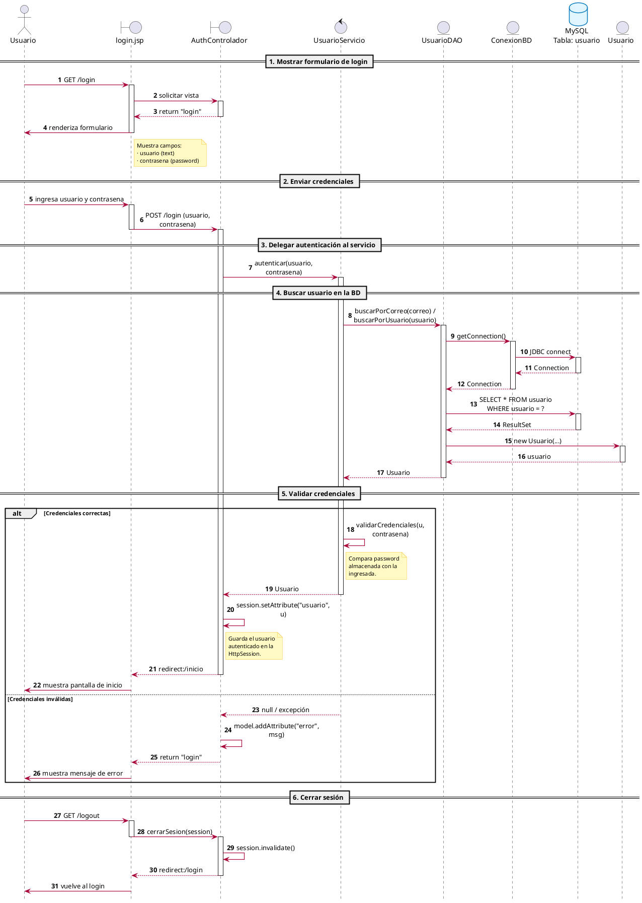

## Diagrama de secuencia - Inicio de Sesion 

```plantuml
@startuml DiagramaSecuencia_Login_WiseTrip
hide footbox
skinparam sequenceMessageAlign center
skinparam responseMessageBelowArrow true
skinparam maxMessageSize 180
skinparam participant {
  BackgroundColor #FEFECE
  BorderColor #A80036
  FontSize 12
}
skinparam database {
  BackgroundColor #E1F5FE
  BorderColor #0277BD
}
skinparam note {
  BackgroundColor #FFF9C4
  BorderColor #FBC02D
  FontSize 11
}
skinparam arrow {
  Color #A80036
  Thickness 1.2
}
autonumber

' ==================== PARTICIPANTES ====================
actor "Usuario" as User
boundary "login.jsp" as JSP
boundary "AuthControlador" as Ctrl
control "UsuarioServicio" as Srv
entity "UsuarioDAO" as DAO
entity "ConexionBD" as Conn
database "MySQL\nTabla: usuario" as DB
entity "Usuario" as Usr

' ==================== FLUJO PRINCIPAL ====================

== 1. Mostrar formulario de login ==

User -> JSP : GET /login
activate JSP
JSP -> Ctrl : solicitar vista
activate Ctrl
Ctrl --> JSP : return "login"
deactivate Ctrl
JSP -> User : renderiza formulario
note right of JSP
  Muestra campos:
  · usuario (text)
  · contrasena (password)
end note
deactivate JSP

== 2. Enviar credenciales ==

User -> JSP : ingresa usuario y contrasena
activate JSP
JSP -> Ctrl : POST /login (usuario, contrasena)
deactivate JSP
activate Ctrl

== 3. Delegar autenticación al servicio ==

Ctrl -> Srv : autenticar(usuario, contrasena)
activate Srv

== 4. Buscar usuario en la BD ==

Srv -> DAO : buscarPorCorreo(correo) / buscarPorUsuario(usuario)
activate DAO

DAO -> Conn : getConnection()
activate Conn
Conn -> DB : JDBC connect
activate DB
DB --> Conn : Connection
deactivate DB
Conn --> DAO : Connection
deactivate Conn

DAO -> DB : SELECT * FROM usuario\nWHERE usuario = ?
activate DB
DB --> DAO : ResultSet
deactivate DB

DAO -> Usr : new Usuario(...)
activate Usr
Usr --> DAO : usuario
deactivate Usr

DAO --> Srv : Usuario
deactivate DAO

== 5. Validar credenciales ==

alt Credenciales correctas

    Srv -> Srv : validarCredenciales(u, contrasena)
    note right of Srv
      Compara password
      almacenada con la
      ingresada.
    end note

    Srv --> Ctrl : Usuario
    deactivate Srv

    Ctrl -> Ctrl : session.setAttribute("usuario", u)
    note right of Ctrl
      Guarda el usuario
      autenticado en la
      HttpSession.
    end note

    Ctrl --> JSP : redirect:/inicio
    deactivate Ctrl
    JSP -> User : muestra pantalla de inicio

else Credenciales inválidas

    Srv --> Ctrl : null / excepción
    deactivate Srv

    Ctrl -> Ctrl : model.addAttribute("error", msg)

    Ctrl --> JSP : return "login"
    deactivate Ctrl

    JSP -> User : muestra mensaje de error

end

== 6. Cerrar sesión ==

User -> JSP : GET /logout
activate JSP
JSP -> Ctrl : cerrarSesion(session)
deactivate JSP
activate Ctrl
Ctrl -> Ctrl : session.invalidate()
Ctrl --> JSP : redirect:/login
deactivate Ctrl
JSP -> User : vuelve al login

@enduml

```

## Imagen del diagrama de Secuencia 

