## Cómo funciona el módulo

La idea central es separar **lo que el negocio sabe hacer** (dominio) de **la tecnología que lo ejecuta** (Spring, base de datos, correo, Telegram). Las capas se hablan a través de **interfaces** (contratos), así que ninguna depende de cómo está hecha la otra.

### Qué hace cada pieza

| Capa | Clase / interfaz | Qué hace |
|---|---|---|
| **Dominio** | `Usuario` | Conoce sus propias reglas: se valida, calcula su edad, comprueba su contraseña, vincula Telegram y saca sus iniciales |
| | `Notificacion` | Guarda el texto de los mensajes (bienvenida y aviso de inicio de sesión) |
| **Contratos** | `IRegistroUsuario` | Validar y registrar un usuario |
| | `IAutenticacionUsuario` | Iniciar sesión |
| | `IPerfilUsuario` | Vincular Telegram |
| | `IUsuarioRepositorio` | Guardar y buscar usuarios |
| | `INotificador` | Enviar un mensaje por un canal |
| **Servicio** | `UsuarioServicio` | Coordina: no tiene reglas propias, solo llama al `Usuario`, al repositorio y a los notificadores |
| | `NotificadorCorreo` / `NotificadorTelegram` | Envían el mensaje por su canal (SMTP o API de Telegram) |
| **Datos** | `UsuarioDAO` | Habla con PostgreSQL (INSERT y SELECT) |
| | `ConexionBD` | Abre la conexión a la base de datos |
| **Controlador** | `AuthControlador`, `TelegramControlador` | Reciben la petición web y llaman a los contratos, sin lógica propia |

### Flujos

**Registro** (`POST /registro`)
1. `AuthControlador` llama a `validarRegistro`.
2. `UsuarioServicio` le pide al `Usuario` que se valide (formato, edad, contraseñas) y consulta al repositorio si el correo o el documento ya existen.
3. Si hay errores, vuelve al formulario con los mensajes.
4. Si no, `registrar`: el `Usuario` se normaliza, el DAO lo guarda y `NotificadorCorreo` envía la bienvenida.
5. El controlador guarda al usuario en la sesión y redirige a `/registro-exitoso`.

**Inicio de sesión** (`POST /login`)
1. `AuthControlador` llama a `iniciarSesion`.
2. El servicio busca al usuario por correo (DAO) y le pregunta al propio `Usuario` si la contraseña coincide.
3. Si tiene Telegram vinculado, `NotificadorTelegram` envía un aviso de inicio de sesión.
4. El controlador guarda la sesión y redirige a `/origen`.

**Vincular Telegram** (`POST /perfil/telegram`)
1. `TelegramControlador` llama a `vincularTelegram`.
2. El servicio le indica al `Usuario` que guarde el chat y luego le pide al DAO que lo persista.

### Decisiones de diseño

- **Dominio separado de la tecnología:** `Usuario` no sabe nada de la base de datos ni del correo. El diagrama de dominio no cambia si se cambia el framework.
- **El servicio solo llama:** `UsuarioServicio` no valida ni calcula; coordina. Las reglas viven en `Usuario`.
- **Interfaces como contratos:** el controlador no conoce `UsuarioServicio`, solo pide "alguien que sepa registrar". Se puede cambiar la implementación sin tocar el controlador.
- **Canal nuevo = clase nueva:** para enviar SMS basta con crear otra clase que implemente `INotificador` (principio abierto/cerrado).
- **Tres interfaces pequeñas:** `UsuarioServicio` implementa `IRegistroUsuario`, `IAutenticacionUsuario` e `IPerfilUsuario`, y cada controlador solo ve la que necesita (segregación de interfaces).
- **`IUsuarioRepositorio` en vez del DAO directo:** el servicio depende del contrato, no de JDBC. Si cambia la base de datos, el negocio no se toca (inversión de dependencias).
- **Textos en `Notificacion`:** qué se le dice al usuario es del negocio; por dónde se envía (correo o Telegram) es tecnología.

##Diagrama de interfaces 

```plantuml
@startuml WiseTrip_Registro_Login
skinparam classAttributeIconSize 0
skinparam linetype polyline
skinparam shadowing false
skinparam packageStyle rectangle
skinparam nodesep 140
skinparam ranksep 170
skinparam padding 6
skinparam ArrowThickness 1.2
skinparam class {
  BackgroundColor #FFFFFF
  BorderColor #444444
  ArrowColor #555555
}
hide empty members

' ================= EXTERNAS =================
package "Externas (framework / JDK)" as Externas <<Rectangle>> #F5F5F5 {
  interface HttpSession <<jakarta.servlet.http>> {
    + getAttribute(nombre: String): Object
    + setAttribute(nombre: String, valor: Object): void
    + invalidate(): void
  }
  interface Model <<org.springframework.ui>> {
    + addAttribute(nombre: String, valor: Object): Model
  }
  interface RedirectAttributes <<org.springframework.web.servlet.mvc.support>> {
    + addFlashAttribute(nombre: String, valor: Object): RedirectAttributes
  }
  interface JavaMailSender <<org.springframework.mail.javamail>> {
    + send(mensaje: SimpleMailMessage): void
  }
  class SimpleMailMessage <<org.springframework.mail>> {
    + setTo(destino: String): void
    + setSubject(asunto: String): void
    + setText(texto: String): void
  }
  class HttpClient <<java.net.http>>
}

' ================= MODELO =================
package "com.wisetrip.modelo" <<Rectangle>> #FFFBE6 {
  class Usuario {
    + {static} EDAD_MINIMA: int = 18
    + {static} EDAD_MAXIMA: int = 120
    + {static} LARGO_MINIMO_PASSWORD: int = 6
    - idUsuario: int
    - nombreCompleto: String
    - tipoDocumento: String
    - numeroDocumento: String
    - fechaNacimiento: String
    - correo: String
    - password: String
    - rol: String = "cliente"
    - chatId: String
    --
    + Usuario()
    + getIdUsuario(): int
    + setIdUsuario(idUsuario: int): void
    + getNombreCompleto(): String
    + setNombreCompleto(nombreCompleto: String): void
    + getTipoDocumento(): String
    + setTipoDocumento(tipoDocumento: String): void
    + getNumeroDocumento(): String
    + setNumeroDocumento(numeroDocumento: String): void
    + getFechaNacimiento(): String
    + setFechaNacimiento(fechaNacimiento: String): void
    + getCorreo(): String
    + setCorreo(correo: String): void
    + getPassword(): String
    + setPassword(password: String): void
    + getRol(): String
    + setRol(rol: String): void
    + getChatId(): String
    + setChatId(chatId: String): void
    + normalizar(): void
    + normalizarCorreo(): void
    + validarDatos(confirmarPassword: String): Map<String, String>
    + calcularEdad(): int
    + verificarPassword(passwordIngresada: String): boolean
    + vincularTelegram(nuevoChatId: String): void
    + tieneTelegramVinculado(): boolean
    + primerNombre(): String
    + iniciales(): String
  }

  class Notificacion {
    - asunto: String
    - cuerpo: String
    --
    + Notificacion(asunto: String, cuerpo: String)
    + {static} bienvenida(usuario: Usuario): Notificacion
    + {static} inicioSesion(usuario: Usuario): Notificacion
    + getAsunto(): String
    + getCuerpo(): String
  }
}

' ================= NEGOCIO (interfaces) =================
package "com.wisetrip.negocio" <<Rectangle>> #E8F4FF {
  interface IRegistroUsuario {
    + validarRegistro(usuario: Usuario, confirmarPassword: String): Map<String, String>
    + registrar(usuario: Usuario): void
  }
  interface IAutenticacionUsuario {
    + iniciarSesion(correo: String, password: String): Usuario
  }
  interface IPerfilUsuario {
    + vincularTelegram(usuario: Usuario, chatId: String): void
  }
  interface IUsuarioRepositorio {
    + registrar(usuario: Usuario): Usuario
    + existeCorreo(correo: String): boolean
    + existeDocumento(numeroDocumento: String): boolean
    + buscarPorCorreo(correo: String): Usuario
    + vincularTelegram(idUsuario: int, chatId: String): void
  }
  interface INotificador {
    + enviar(destino: String, notificacion: Notificacion): void
  }
}

' ================= SERVICIO =================
package "com.wisetrip.servicio" <<Rectangle>> #EAF7EA {
  class UsuarioServicio <<@Service>> {
    - {static} MSG_DOCUMENTO_EXISTE: String
    - {static} MSG_CORREO_EXISTE: String
    - repositorio: IUsuarioRepositorio
    - notificadorCorreo: INotificador
    - notificadorTelegram: INotificador
    --
    + UsuarioServicio(repositorio: IUsuarioRepositorio, notificadorCorreo: INotificador, notificadorTelegram: INotificador)
    + validarRegistro(usuario: Usuario, confirmarPassword: String): Map<String, String>
    + registrar(usuario: Usuario): void
    + iniciarSesion(correo: String, password: String): Usuario
    + vincularTelegram(usuario: Usuario, chatId: String): void
    - notificar(notificador: INotificador, destino: String, notificacion: Notificacion): void
  }

  class NotificadorCorreo <<@Service("notificadorCorreo")>> {
    - mailSender: JavaMailSender
    --
    + NotificadorCorreo(mailSender: JavaMailSender)
    + enviar(destino: String, notificacion: Notificacion): void
  }

  class NotificadorTelegram <<@Service("notificadorTelegram")>> {
    - botToken: String
    - httpClient: HttpClient
    --
    + enviar(destino: String, notificacion: Notificacion): void
  }
}

' ================= DATOS =================
package "com.wisetrip.datos" <<Rectangle>> #FDECEC {
  class UsuarioDAO <<@Repository>> {
    + registrar(usuario: Usuario): Usuario
    + existeCorreo(correo: String): boolean
    + existeDocumento(numeroDocumento: String): boolean
    + buscarPorCorreo(correo: String): Usuario
    + vincularTelegram(idUsuario: int, chatId: String): void
    - existe(sql: String, valor: String): boolean
    - parseFecha(fecha: String): Date
  }
  class ConexionBD {
    - {static} PROPIEDADES: Properties
    --
    + {static} obtenerConexion(): Connection
    - {static} cargarPropiedades(): Properties
  }
}

' ================= CONTROLADOR =================
package "com.wisetrip.controlador" <<Rectangle>> #F1ECFA {
  class AuthControlador <<@Controller>> {
    - registro: IRegistroUsuario
    - autenticacion: IAutenticacionUsuario
    --
    + AuthControlador(registro: IRegistroUsuario, autenticacion: IAutenticacionUsuario)
    + mostrarRegistro(model: Model): String  «GET /registro»
    + procesarRegistro(usuario: Usuario, confirmarPassword: String, sesion: HttpSession, model: Model, flash: RedirectAttributes): String  «POST /registro»
    + registroExitoso(): String  «GET /registro-exitoso»
    + mostrarLogin(): String  «GET /login»
    + procesarLogin(correo: String, password: String, sesion: HttpSession, model: Model): String  «POST /login»
    + cerrarSesion(sesion: HttpSession): String  «GET /logout»
  }

  class TelegramControlador <<@Controller>> {
    - perfil: IPerfilUsuario
    --
    + TelegramControlador(perfil: IPerfilUsuario)
    + mostrarVinculacion(sesion: HttpSession, model: Model): String  «GET /perfil/telegram»
    + procesarVinculacion(chatId: String, sesion: HttpSession, flash: RedirectAttributes): String  «POST /perfil/telegram»
  }
}

' ================= REALIZACIONES (implements) =================
UsuarioServicio .up.|> IRegistroUsuario
UsuarioServicio .up.|> IAutenticacionUsuario
UsuarioServicio .up.|> IPerfilUsuario
NotificadorCorreo .up.|> INotificador
NotificadorTelegram .up.|> INotificador
UsuarioDAO .up.|> IUsuarioRepositorio

' ================= CONTROLADOR =================
AuthControlador -down-> IRegistroUsuario : registro
AuthControlador -down-> IAutenticacionUsuario : autenticacion
AuthControlador .left.> Usuario
AuthControlador .right.> Externas : usa HttpSession,\nModel y\nRedirectAttributes
TelegramControlador -down-> IPerfilUsuario : perfil
TelegramControlador .left.> Usuario
TelegramControlador .right.> Externas : usa HttpSession,\nModel y\nRedirectAttributes

' ================= SERVICIO =================
UsuarioServicio -up-> IUsuarioRepositorio : repositorio
UsuarioServicio -up-> INotificador : notificadorCorreo\nnotificadorTelegram
UsuarioServicio .left.> Usuario
UsuarioServicio .left.> Notificacion

NotificadorCorreo -right-> JavaMailSender
NotificadorCorreo .right.> SimpleMailMessage
NotificadorCorreo .left.> Notificacion
NotificadorTelegram -right-> HttpClient
NotificadorTelegram .left.> Notificacion

' ================= INTERFACES -> MODELO =================
IRegistroUsuario .left.> Usuario
IAutenticacionUsuario .left.> Usuario
IPerfilUsuario .left.> Usuario
IUsuarioRepositorio .left.> Usuario
INotificador .left.> Notificacion

' ================= DATOS =================
UsuarioDAO -right-> ConexionBD
UsuarioDAO .left.> Usuario

' ================= MODELO =================
Notificacion .up.> Usuario : «bienvenida / inicioSesion»

' ================= ORDEN DEL DIBUJO (invisibles) =================
IRegistroUsuario -[hidden]right- IAutenticacionUsuario
IAutenticacionUsuario -[hidden]right- IPerfilUsuario
IPerfilUsuario -[hidden]right- IUsuarioRepositorio
IUsuarioRepositorio -[hidden]right- INotificador
UsuarioServicio -[hidden]right- NotificadorCorreo
NotificadorCorreo -[hidden]right- NotificadorTelegram
AuthControlador -[hidden]right- TelegramControlador

@enduml
```

