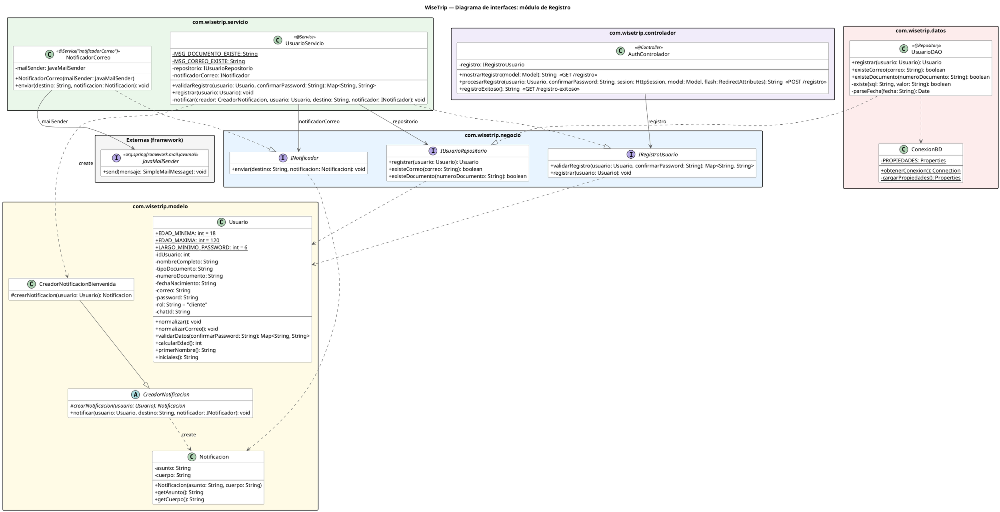

##Diagrama de interfaces 

```plantuml
@startuml WiseTrip_Registro
title WiseTrip — Diagrama de interfaces: módulo de Registro

skinparam classAttributeIconSize 0
skinparam shadowing false
skinparam packageStyle rectangle
skinparam nodesep 50
skinparam ranksep 70
skinparam class {
  BackgroundColor #FFFFFF
  BorderColor #444444
  ArrowColor #555555
}
set separator none
hide empty members

' ================= EXTERNAS =================
package "Externas (framework)" #F5F5F5 {
  interface JavaMailSender <<org.springframework.mail.javamail>> {
    + send(mensaje: SimpleMailMessage): void
  }
}

' ================= MODELO =================
package "com.wisetrip.modelo" #FFFBE6 {
  class Usuario {
    + {static} EDAD_MINIMA: int = 18
    + {static} EDAD_MAXIMA: int = 120
    + {static} LARGO_MINIMO_PASSWORD: int = 6
    - idUsuario: int
    - nombreCompleto: String
    - tipoDocumento: String
    - numeroDocumento: String
    - fechaNacimiento: String
    - correo: String
    - password: String
    - rol: String = "cliente"
    - chatId: String
    --
    + normalizar(): void
    + normalizarCorreo(): void
    + validarDatos(confirmarPassword: String): Map<String, String>
    + calcularEdad(): int
    + primerNombre(): String
    + iniciales(): String
  }

  class Notificacion {
    - asunto: String
    - cuerpo: String
    --
    + Notificacion(asunto: String, cuerpo: String)
    + getAsunto(): String
    + getCuerpo(): String
  }

  abstract class CreadorNotificacion {
    # {abstract} crearNotificacion(usuario: Usuario): Notificacion
    + notificar(usuario: Usuario, destino: String, notificador: INotificador): void
  }

  class CreadorNotificacionBienvenida {
    # crearNotificacion(usuario: Usuario): Notificacion
  }
}

' ================= NEGOCIO =================
package "com.wisetrip.negocio" #E8F4FF {
  interface IRegistroUsuario {
    + validarRegistro(usuario: Usuario, confirmarPassword: String): Map<String, String>
    + registrar(usuario: Usuario): void
  }
  interface IUsuarioRepositorio {
    + registrar(usuario: Usuario): Usuario
    + existeCorreo(correo: String): boolean
    + existeDocumento(numeroDocumento: String): boolean
  }
  interface INotificador {
    + enviar(destino: String, notificacion: Notificacion): void
  }
}

' ================= SERVICIO =================
package "com.wisetrip.servicio" #EAF7EA {
  class UsuarioServicio <<@Service>> {
    - {static} MSG_DOCUMENTO_EXISTE: String
    - {static} MSG_CORREO_EXISTE: String
    - repositorio: IUsuarioRepositorio
    - notificadorCorreo: INotificador
    --
    + validarRegistro(usuario: Usuario, confirmarPassword: String): Map<String, String>
    + registrar(usuario: Usuario): void
    - notificar(creador: CreadorNotificacion, usuario: Usuario, destino: String, notificador: INotificador): void
  }

  class NotificadorCorreo <<@Service("notificadorCorreo")>> {
    - mailSender: JavaMailSender
    --
    + NotificadorCorreo(mailSender: JavaMailSender)
    + enviar(destino: String, notificacion: Notificacion): void
  }
}

' ================= DATOS =================
package "com.wisetrip.datos" #FDECEC {
  class UsuarioDAO <<@Repository>> {
    + registrar(usuario: Usuario): Usuario
    + existeCorreo(correo: String): boolean
    + existeDocumento(numeroDocumento: String): boolean
    - existe(sql: String, valor: String): boolean
    - parseFecha(fecha: String): Date
  }
  class ConexionBD {
    - {static} PROPIEDADES: Properties
    --
    + {static} obtenerConexion(): Connection
    - {static} cargarPropiedades(): Properties
  }
}

' ================= CONTROLADOR =================
package "com.wisetrip.controlador" #F1ECFA {
  class AuthControlador <<@Controller>> {
    - registro: IRegistroUsuario
    --
    + mostrarRegistro(model: Model): String  «GET /registro»
    + procesarRegistro(usuario: Usuario, confirmarPassword: String, sesion: HttpSession, model: Model, flash: RedirectAttributes): String  «POST /registro»
    + registroExitoso(): String  «GET /registro-exitoso»
  }
}

' ================= HERENCIA / REALIZACION =================
UsuarioServicio ..|> IRegistroUsuario
NotificadorCorreo ..|> INotificador
UsuarioDAO ..|> IUsuarioRepositorio
CreadorNotificacionBienvenida --|> CreadorNotificacion

' ================= ASOCIACIONES (atributos) =================
AuthControlador --> IRegistroUsuario : registro
UsuarioServicio --> IUsuarioRepositorio : repositorio
UsuarioServicio --> INotificador : notificadorCorreo
NotificadorCorreo --> JavaMailSender : mailSender

' ================= DEPENDENCIAS ESENCIALES =================
UsuarioServicio ..> CreadorNotificacionBienvenida : «create»
CreadorNotificacion ..> Notificacion : «create»
INotificador ..> Notificacion
IRegistroUsuario ..> Usuario
IUsuarioRepositorio ..> Usuario
UsuarioDAO ..> ConexionBD

@enduml

```

